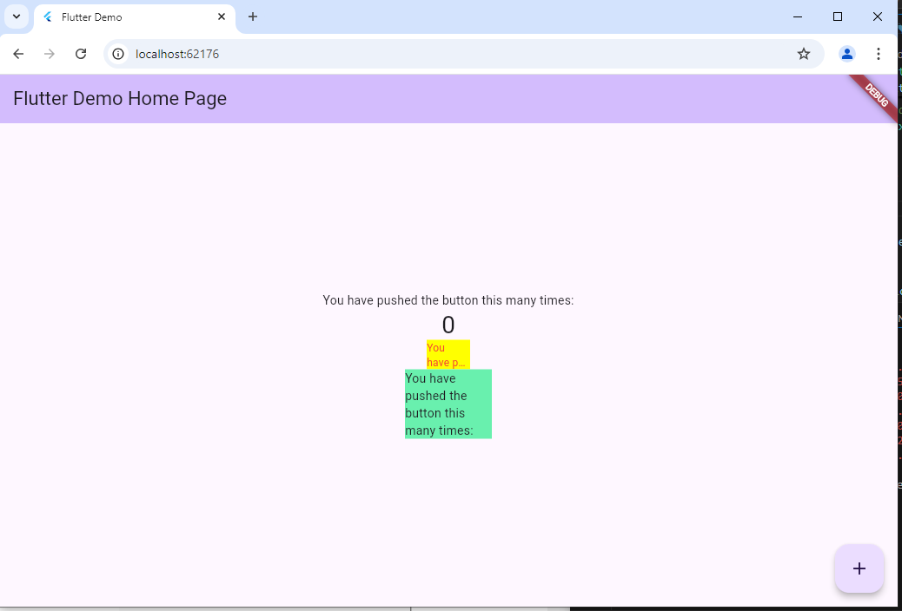

<h1>LAPORAN PRAKTIKUM PEMROGRAMAN BERBASIS MOBILE</h1>
Dosen Pembimbing : Ade Ismail, S.Kom, M.TI.<hr>
Nama : Faiz Nala Samudera<br>
Kelas : SIB-3D<br>
NIM : 2241760043<hr><br><br>

<h3>Praktikum</h3>

1. Langkah 1: Buat Project Baru <br>
Buatlah sebuah project flutter baru dengan nama flutter_plugin_pubdev. Lalu jadikan repository di GitHub Anda dengan nama flutter_plugin_pubdev.
2. Langkah 2: Menambahkan Plugin <br>
Tambahkan plugin auto_size_text menggunakan perintah berikut di terminal.
    ```
    flutter pub add auto_size_text
    ```
    Jika berhasil, maka akan tampil nama plugin beserta versinya di file pubspec.yaml pada bagian dependencies.
3. Langkah 3: Buat file red_text_widget.dart<br>
    Buat file baru bernama red_text_widget.dart di dalam folder lib lalu isi kode seperti berikut.
    ```
    import 'package:flutter/material.dart';

    class RedTextWidget extends StatelessWidget {
    const RedTextWidget({Key? key}) : super(key: key);

    @override
    Widget build(BuildContext context) {
        return Container();
    }
    }
    ```
4. Langkah 4: Tambah Widget AutoSizeText<br>
    Masih di file red_text_widget.dart, untuk menggunakan plugin auto_size_text, ubahlah kode return Container() menjadi seperti berikut.
    ```
    return AutoSizeText(
        text,
        style: const TextStyle(color: Colors.red, fontSize: 14),
        maxLines: 2,
        overflow: TextOverflow.ellipsis,
    );
    ```
    Setelah Anda menambahkan kode di atas, Anda akan mendapatkan info error. Mengapa demikian? Jelaskan dalam laporan praktikum Anda!
5. Langkah 5: Buat Variabel text dan parameter di constructor<br>
    Tambahkan variabel text dan parameter di constructor seperti berikut.
    ```
    final String text;

    const RedTextWidget({Key? key, required this.text}) : super(key: key);
    ```
6. Langkah 6: Tambahkan widget di main.dart<br>
    Buka file main.dart lalu tambahkan di dalam children: pada class _MyHomePageState
    ```
    Container(
    color: Colors.yellowAccent,
    width: 50,
    child: const RedTextWidget(
                text: 'You have pushed the button this many times:',
            ),
    ),
    Container(
        color: Colors.greenAccent,
        width: 100,
        child: const Text(
            'You have pushed the button this many times:',
            ),
    ),
    ```
    Run aplikasi tersebut dengan tekan F5, maka hasilnya akan seperti berikut.<br>
    