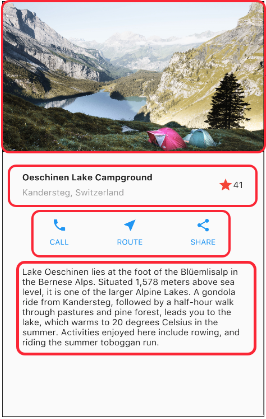
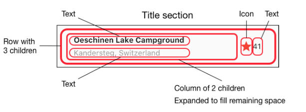
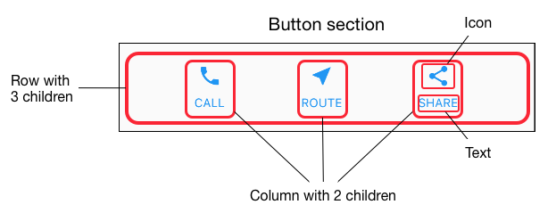
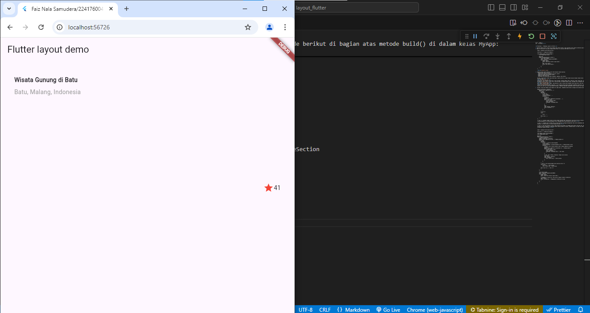
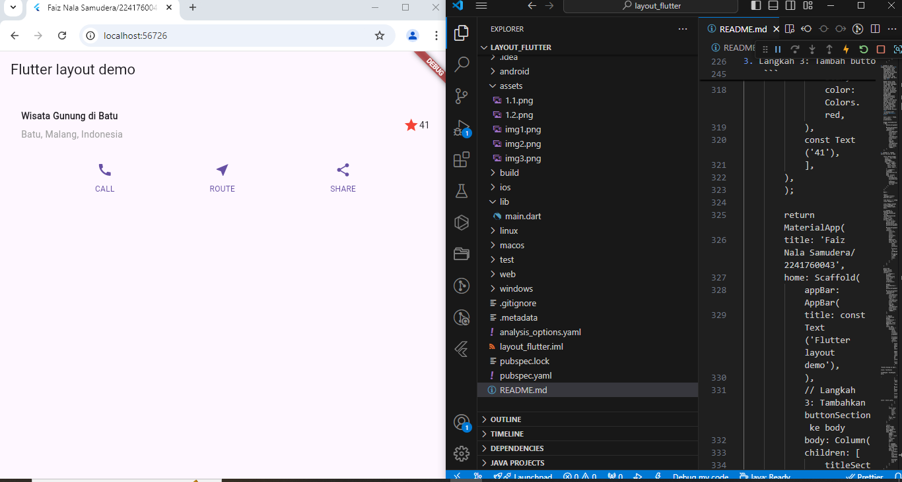
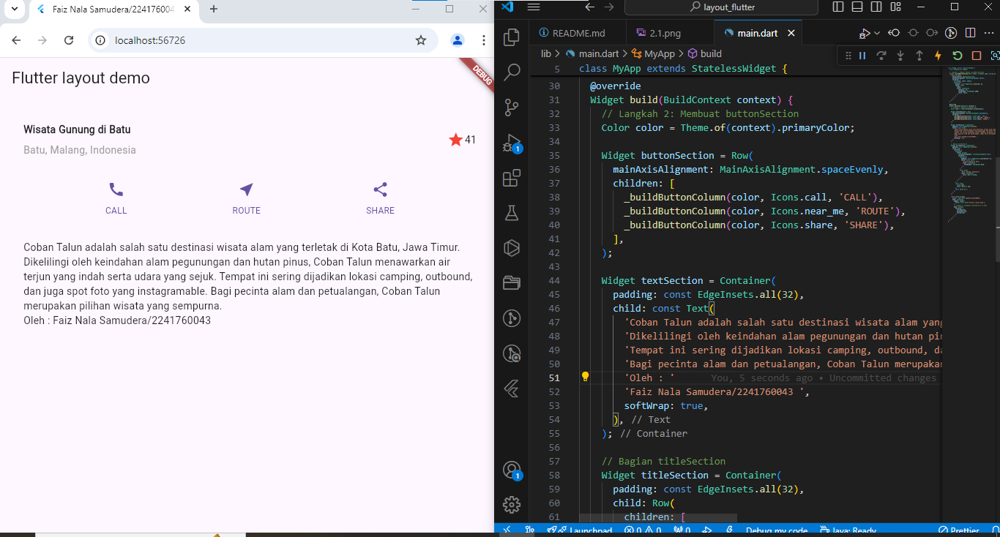
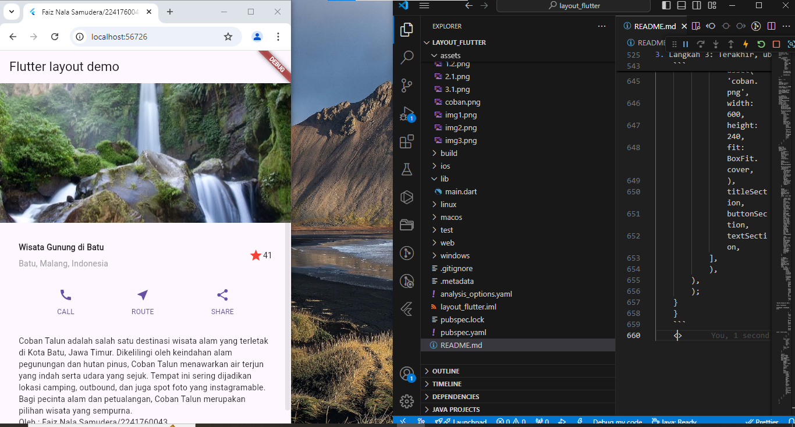

<h1>LAPORAN PRAKTIKUM PEMROGRAMAN BERBASI MOBILE</h1>
Dosen Pembimbing : Ade Ismail, S.Kom, M, TI. <hr>
Nama : Faiz Nala Samudera<br>
Kelas : SIB3D<br>
NIM : 2241760043<br><hr>

<h3>Praktikum 1 : Membangun Layout di Flutter</h3>

1. Buatlah sebuah project flutter baru dengan nama layout_flutter. Atau sesuaikan style laporan praktikum yang Anda buat.
2. Buka file main.dart lalu ganti dengan kode berikut. Isi nama dan NIM Anda di text title.

   ```
   import 'package:flutter/material.dart';

   void main() => runApp(const MyApp());

   class MyApp extends StatelessWidget {
       const MyApp({super.key});

       @override
       Widget build(BuildContext context) {
           return MaterialApp(
           title: 'Faiz Nala Samudera/2241760043',
           home: Scaffold(
               appBar: AppBar(
               title: const Text('Flutter layout demo'),
               ),
               body: const Center(
               child: Text('Hello World'),
               ),
           ),
           );
       }
   }
   ```

   

3. Langkah pertama adalah memecah tata letak menjadi elemen dasarnya:

   - Identifikasi baris dan kolom.
   - Apakah tata letaknya menyertakan kisi-kisi (grid)?
   - Apakah ada elemen yang tumpang tindih?
   - Apakah UI memerlukan tab?
   - Perhatikan area yang memerlukan alignment, padding, atau borders.

   Pertama, identifikasi elemen yang lebih besar. Dalam contoh ini, empat elemen disusun menjadi sebuah kolom: sebuah gambar, dua baris, dan satu blok teks.<br>
   <br>
   Selanjutnya, buat diagram setiap baris. Baris pertama, disebut bagian Judul, memiliki 3 anak: kolom teks, ikon bintang, dan angka. Anak pertamanya, kolom, berisi 2 baris teks. Kolom pertama itu memakan banyak ruang, sehingga harus dibungkus dengan widget yang Diperluas.<br>
   <br>
   Baris kedua, disebut bagian Tombol, juga memiliki 3 anak: setiap anak merupakan kolom yang berisi ikon dan teks.<br>
   <br>
   Setelah tata letak telah dibuat diagramnya, cara termudah adalah dengan menerapkan pendekatan bottom-up. Untuk meminimalkan kebingungan visual dari kode tata letak yang banyak bertumpuk, tempatkan beberapa implementasi dalam variabel dan fungsi.

4. Pertama, Anda akan membuat kolom bagian kiri pada judul. Tambahkan kode berikut di bagian atas metode build() di dalam kelas MyApp:

   ```
   Widget titleSection = Container(
       padding: const EdgeInsets.all(...),
       child: Row(
           children: [
           Expanded(
               /* soal 1*/
               child: Column(
               crossAxisAlignment: ...,
               children: [
                   /* soal 2*/
                   Container(
                   padding: const EdgeInsets.only(bottom: ...),
                   child: const Text(
                       'Wisata Gunung di Batu',
                       style: TextStyle(
                       fontWeight: FontWeight.bold,
                       ),
                   ),
                   ),
                   Text(
                   'Batu, Malang, Indonesia',
                   style: TextStyle(...),
                   ),
               ],
               ),
           ),
           /* soal 3*/
           Icon(
           ...,
               color: ...,
           ),
           const Text(...),
           ],
       ),
   );
   ```

   /_ soal 1 _/ Letakkan widget Column di dalam widget Expanded agar menyesuaikan ruang yang tersisa di dalam widget Row. Tambahkan properti crossAxisAlignment ke CrossAxisAlignment.start sehingga posisi kolom berada di awal baris.<br><br>

   /_ soal 2 _/ Letakkan baris pertama teks di dalam Container sehingga memungkinkan Anda untuk menambahkan padding = 8. Teks ‘Batu, Malang, Indonesia' di dalam Column, set warna menjadi abu-abu.<br><br>

   /_ soal 3 _/ Dua item terakhir di baris judul adalah ikon bintang, set dengan warna merah, dan teks "41". Seluruh baris ada di dalam Container dan beri padding di sepanjang setiap tepinya sebesar 32 piksel. Kemudian ganti isi body text ‘Hello World' dengan variabel titleSection seperti berikut: <br><br>

   ```
   import 'package:flutter/material.dart';

   void main() => runApp(const MyApp());

   class MyApp extends StatelessWidget {
   const MyApp({super.key});

   @override
   Widget build(BuildContext context) {
       // Bagian titleSection
       Widget titleSection = Container(
       padding: const EdgeInsets.all(32), // Padding sebesar 32
       child: Row(
           children: [
           Expanded(
               // Soal 1: Column di dalam Expanded
               child: Column(
               crossAxisAlignment: CrossAxisAlignment.start, // Menyelaraskan ke awal
               children: [
                   // Soal 2: Teks 'Wisata Gunung di Batu' dengan padding di bawahnya
                   Container(
                   padding: const EdgeInsets.only(bottom: 8), // Padding bawah 8
                   child: const Text(
                       'Wisata Gunung di Batu',
                       style: TextStyle(
                       fontWeight: FontWeight.bold, // Teks tebal
                       ),
                   ),
                   ),
                   // Teks 'Batu, Malang, Indonesia' dengan warna abu-abu
                   const Text(
                   'Batu, Malang, Indonesia',
                   style: TextStyle(
                       color: Colors.grey, // Warna abu-abu
                   ),
                   ),
               ],
               ),
           ),
           // Soal 3: Icon bintang dengan warna merah dan teks '41'
           const Icon(
               Icons.star, // Ikon bintang
               color: Colors.red, // Warna merah
           ),
           const Text('41'), // Teks '41'
           ],
       ),
       );

       return MaterialApp(
       title: 'Faiz Nala Samudera/2241760043',
       home: Scaffold(
           appBar: AppBar(
           title: const Text('Flutter layout demo'),
           ),
           // Mengganti isi body text 'Hello World' dengan variabel titleSection
           body: Center(
           child: titleSection, // Menggunakan titleSection di body
           ),
       ),
       );
   }
   }
   ```

   <br>

<h3>Praktikum 2: Implementasi button row</h3>

1.  Langkah 1: Buat method Column _buildButtonColumn<br>
    Bagian tombol berisi 3 kolom yang menggunakan tata letak yang sama—sebuah ikon di atas baris teks. Kolom pada baris ini diberi jarak yang sama, dan teks serta ikon diberi warna primer.
    <br>
    Karena kode untuk membangun setiap kolom hampir sama, buatlah metode pembantu pribadi bernama buildButtonColumn(), yang mempunyai parameter warna, Icon dan Text, sehingga dapat mengembalikan kolom dengan widgetnya sesuai dengan warna tertentu.
    <br>
    <b>lib/main.dart (\_buildButtonColumn)</b>
    ```
    class MyApp extends StatelessWidget {
    const MyApp({super.key});

            @override
            Widget build(BuildContext context) {
                // ···
            }

            Column _buildButtonColumn(Color color, IconData icon, String label) {
                return Column(
                    mainAxisSize: MainAxisSize.min,
                    mainAxisAlignment: MainAxisAlignment.center,
                    children: [
                        Icon(icon, color: color),
                        Container(
                        margin: const EdgeInsets.only(top: 8),
                            child: Text(
                                label,
                                style: TextStyle(
                                fontSize: 12,
                                fontWeight: FontWeight.w400,
                                color: color,
                                ),
                            ),
                        ),
                    ],
                );
            }
        }
        ```

2. Langkah 2: Buat widget buttonSection<br>
    Buat Fungsi untuk menambahkan ikon langsung ke kolom. Teks berada di dalam Container dengan margin hanya di bagian atas, yang memisahkan teks dari ikon.<br>

    Bangun baris yang berisi kolom-kolom ini dengan memanggil fungsi dan set warna, Icon, dan teks khusus melalui parameter ke kolom tersebut. Sejajarkan kolom di sepanjang sumbu utama menggunakan MainAxisAlignment.spaceEvenly untuk mengatur ruang kosong secara merata sebelum, di antara, dan setelah setiap kolom. Tambahkan kode berikut tepat di bawah deklarasi titleSection di dalam metode build():<br>
    <b>lib/main.dart (button<Section)</b><br>
    ```
    Color color = Theme.of(context).primaryColor;

    Widget buttonSection = Row(
        mainAxisAlignment: MainAxisAlignment.spaceEvenly,
        children: [
            _buildButtonColumn(color, Icons.call, 'CALL'),
            _buildButtonColumn(color, Icons.near_me, 'ROUTE'),
            _buildButtonColumn(color, Icons.share, 'SHARE'),
        ],
    );
    ```  
3. Langkah 3: Tambah button section ke body
    ```
    return MaterialApp(
      title: 'Faiz Nala Samudera/2241760043',
      home: Scaffold(
        appBar: AppBar(
          title: const Text('Flutter layout demo'),
        ),
        // Langkah 3: Tambahkan buttonSection ke body
        body: Column(
          children: [
            titleSection,
            buttonSection, // Tambahkan buttonSection di sini
          ],
        ),
      ),
    );
    ```
    Hasil : 
    ```
    import 'package:flutter/material.dart';

    void main() => runApp(const MyApp());

    class MyApp extends StatelessWidget {
    const MyApp({super.key});

    // Langkah 1: Membuat method _buildButtonColumn
    Column _buildButtonColumn(Color color, IconData icon, String label) {
        return Column(
        mainAxisSize: MainAxisSize.min,
        mainAxisAlignment: MainAxisAlignment.center,
        children: [
            Icon(icon, color: color),
            Container(
            margin: const EdgeInsets.only(top: 8),
            child: Text(
                label,
                style: TextStyle(
                fontSize: 12,
                fontWeight: FontWeight.w400,
                color: color,
                ),
            ),
            ),
        ],
        );
    }

    @override
    Widget build(BuildContext context) {
        // Langkah 2: Membuat buttonSection
        Color color = Theme.of(context).primaryColor;

        Widget buttonSection = Row(
        mainAxisAlignment: MainAxisAlignment.spaceEvenly,
        children: [
            _buildButtonColumn(color, Icons.call, 'CALL'),
            _buildButtonColumn(color, Icons.near_me, 'ROUTE'),
            _buildButtonColumn(color, Icons.share, 'SHARE'),
        ],
        );

        // Bagian titleSection 
        Widget titleSection = Container(
        padding: const EdgeInsets.all(32),
        child: Row(
            children: [
            Expanded(
                child: Column(
                crossAxisAlignment: CrossAxisAlignment.start,
                children: [
                    Container(
                    padding: const EdgeInsets.only(bottom: 8),
                    child: const Text(
                        'Wisata Gunung di Batu',
                        style: TextStyle(
                        fontWeight: FontWeight.bold,
                        ),
                    ),
                    ),
                    const Text(
                    'Batu, Malang, Indonesia',
                    style: TextStyle(
                        color: Colors.grey,
                    ),
                    ),
                ],
                ),
            ),
            const Icon(
                Icons.star,
                color: Colors.red,
            ),
            const Text('41'),
            ],
        ),
        );

        return MaterialApp(
        title: 'Faiz Nala Samudera/2241760043',
        home: Scaffold(
            appBar: AppBar(
            title: const Text('Flutter layout demo'),
            ),
            // Langkah 3: Tambahkan buttonSection ke body
            body: Column(
            children: [
                titleSection,
                buttonSection, // Tambahkan buttonSection di sini
            ],
            ),
        ),
        );
    }
    }
    ```
    <br>

<h3>Praktikum 3: Implementasi text section</h3>

1. Langkah 1: Buat widget textSection<br>
    Tentukan bagian teks sebagai variabel. Masukkan teks ke dalam Container dan tambahkan padding di sepanjang setiap tepinya. Tambahkan kode berikut tepat di bawah deklarasi buttonSection:
    ```
    Widget textSection = Container(
        padding: const EdgeInsets.all(32),
        child: const Text(
            'Carilah teks di internet yang sesuai '
            'dengan foto atau tempat wisata yang ingin '
            'Anda tampilkan. '
            'Tambahkan nama dan NIM Anda sebagai '
            'identitas hasil pekerjaan Anda. '
            'Selamat mengerjakan 🙂.',
            softWrap: true,
        ),
    );
    ```
    Dengan memberi nilai softWrap = true, baris teks akan memenuhi lebar kolom sebelum membungkusnya pada batas kata.
2. Langkah 2: Tambahkan variabel text section ke body<br>
    Tambahkan widget variabel textSection ke dalam body seperti berikut:
    ```
    return MaterialApp(
      title: 'Faiz Nala Samudera/2241760043',
      home: Scaffold(
        appBar: AppBar(
          title: const Text('Flutter layout demo'),
        ),
        // Langkah 3: Tambahkan buttonSection ke body
        body: Column(
          children: [
            titleSection,
            buttonSection, 
            textSection
          ],
        ),
      ),
    );
    ```
    Hasil
    ```
    import 'package:flutter/material.dart';

    void main() => runApp(const MyApp());

    class MyApp extends StatelessWidget {
    const MyApp({super.key});

    // Langkah 1: Membuat method _buildButtonColumn
    Column _buildButtonColumn(Color color, IconData icon, String label) {
        return Column(
        mainAxisSize: MainAxisSize.min,
        mainAxisAlignment: MainAxisAlignment.center,
        children: [
            Icon(icon, color: color),
            Container(
            margin: const EdgeInsets.only(top: 8),
            child: Text(
                label,
                style: TextStyle(
                fontSize: 12,
                fontWeight: FontWeight.w400,
                color: color,
                ),
            ),
            ),
        ],
        );
    }

    @override
    Widget build(BuildContext context) {
        // Langkah 2: Membuat buttonSection
        Color color = Theme.of(context).primaryColor;

        Widget buttonSection = Row(
        mainAxisAlignment: MainAxisAlignment.spaceEvenly,
        children: [
            _buildButtonColumn(color, Icons.call, 'CALL'),
            _buildButtonColumn(color, Icons.near_me, 'ROUTE'),
            _buildButtonColumn(color, Icons.share, 'SHARE'),
        ],
        );

        Widget textSection = Container(
        padding: const EdgeInsets.all(32),
        child: const Text(
            'Coban Talun adalah salah satu destinasi wisata alam yang terletak di Kota Batu, Jawa Timur. '
            'Dikelilingi oleh keindahan alam pegunungan dan hutan pinus, Coban Talun menawarkan air terjun yang indah serta udara yang sejuk. '
            'Tempat ini sering dijadikan lokasi camping, outbound, dan juga spot foto yang instagramable. '
            'Bagi pecinta alam dan petualangan, Coban Talun merupakan pilihan wisata yang sempurna. '
            'Nama: Faiz Nala Samudera '
            'NIM: 2241760043',
            softWrap: true,
        ),
        );

        // Bagian titleSection 
        Widget titleSection = Container(
        padding: const EdgeInsets.all(32),
        child: Row(
            children: [
            Expanded(
                child: Column(
                crossAxisAlignment: CrossAxisAlignment.start,
                children: [
                    Container(
                    padding: const EdgeInsets.only(bottom: 8),
                    child: const Text(
                        'Wisata Gunung di Batu',
                        style: TextStyle(
                        fontWeight: FontWeight.bold,
                        ),
                    ),
                    ),
                    const Text(
                    'Batu, Malang, Indonesia',
                    style: TextStyle(
                        color: Colors.grey,
                    ),
                    ),
                ],
                ),
            ),
            const Icon(
                Icons.star,
                color: Colors.red,
            ),
            const Text('41'),
            ],
        ),
        );

        return MaterialApp(
        title: 'Faiz Nala Samudera/2241760043',
        home: Scaffold(
            appBar: AppBar(
            title: const Text('Flutter layout demo'),
            ),
            // Langkah 3: Tambahkan buttonSection ke body
            body: Column(
            children: [
                titleSection,
                buttonSection, 
                textSection
            ],
            ),
        ),
        );
    }
    }
    ```
    <br>

<h3>Praktikum 4: Implementasi image section</h3>

1. Langkah 1: Siapkan aset gambar<br>
    Anda dapat mencari gambar di internet yang ingin ditampilkan. Buatlah folder images di root project layout_flutter. Masukkan file gambar tersebut ke folder images, lalu set nama file tersebut ke file pubspec.yaml seperti berikut:
    ```
    assets:
        - assets/coban.png
    ```
2. Langkah 2: Tambahkan gambar ke body<br>
    Tambahkan aset gambar ke dalam body seperti berikut:
    ```
    body: Column(
          children: [
            Image.asset(
              'assets/coban.png',
              width: 600,
              height: 240,
              fit: BoxFit.cover,
            ),
            titleSection,
            buttonSection, 
            textSection
          ],
    ),
    ```
    BoxFit.cover memberi tahu kerangka kerja bahwa gambar harus sekecil mungkin tetapi menutupi seluruh kotak rendernya.
3. Langkah 3: Terakhir, ubah menjadi ListView<br>
    Pada langkah terakhir ini, atur semua elemen dalam ListView, bukan Column, karena ListView mendukung scroll yang dinamis saat aplikasi dijalankan pada perangkat yang resolusinya lebih kecil.
    ```
    body: ListView(
        children: [
            Image.asset(
              'coban.png',
              width: 600,
              height: 240,
              fit: BoxFit.cover,
            ),
            titleSection,
            buttonSection,
            textSection,
        ],
    ),
    ```
    Hasil : 
    ```
    import 'package:flutter/material.dart';

    void main() => runApp(const MyApp());

    class MyApp extends StatelessWidget {
    const MyApp({super.key});

    // Langkah 1: Membuat method _buildButtonColumn
    Column _buildButtonColumn(Color color, IconData icon, String label) {
        return Column(
        mainAxisSize: MainAxisSize.min,
        mainAxisAlignment: MainAxisAlignment.center,
        children: [
            Icon(icon, color: color),
            Container(
            margin: const EdgeInsets.only(top: 8),
            child: Text(
                label,
                style: TextStyle(
                fontSize: 12,
                fontWeight: FontWeight.w400,
                color: color,
                ),
            ),
            ),
        ],
        );
    }

    @override
    Widget build(BuildContext context) {
        // Langkah 2: Membuat buttonSection
        Color color = Theme.of(context).primaryColor;

        Widget buttonSection = Row(
        mainAxisAlignment: MainAxisAlignment.spaceEvenly,
        children: [
            _buildButtonColumn(color, Icons.call, 'CALL'),
            _buildButtonColumn(color, Icons.near_me, 'ROUTE'),
            _buildButtonColumn(color, Icons.share, 'SHARE'),
        ],
        );

        Widget textSection = Container(
        padding: const EdgeInsets.all(32),
        child: const Text(
            'Coban Talun adalah salah satu destinasi wisata alam yang terletak di Kota Batu, Jawa Timur. '
            'Dikelilingi oleh keindahan alam pegunungan dan hutan pinus, Coban Talun menawarkan air terjun yang indah serta udara yang sejuk. '
            'Tempat ini sering dijadikan lokasi camping, outbound, dan juga spot foto yang instagramable. '
            'Bagi pecinta alam dan petualangan, Coban Talun merupakan pilihan wisata yang sempurna. \n'
            'Oleh : '
            'Faiz Nala Samudera/2241760043 ',
            softWrap: true,
        ),
        );

        // Bagian titleSection
        Widget titleSection = Container(
        padding: const EdgeInsets.all(32),
        child: Row(
            children: [
            Expanded(
                child: Column(
                crossAxisAlignment: CrossAxisAlignment.start,
                children: [
                    Container(
                    padding: const EdgeInsets.only(bottom: 8),
                    child: const Text(
                        'Wisata Gunung di Batu',
                        style: TextStyle(
                        fontWeight: FontWeight.bold,
                        ),
                    ),
                    ),
                    const Text(
                    'Batu, Malang, Indonesia',
                    style: TextStyle(
                        color: Colors.grey,
                    ),
                    ),
                ],
                ),
            ),
            const Icon(
                Icons.star,
                color: Colors.red,
            ),
            const Text('41'),
            ],
        ),
        );

        return MaterialApp(
        title: 'Faiz Nala Samudera/2241760043',
        home: Scaffold(
            appBar: AppBar(
            title: const Text('Flutter layout demo'),
            ),
            body: ListView(
            children: [
                Image.asset(
                'coban.png',
                width: 600,
                height: 240,
                fit: BoxFit.cover,
                ),
                titleSection,
                buttonSection,
                textSection,
            ],
            ),
        ),
        );
    }
    }
    ```
    