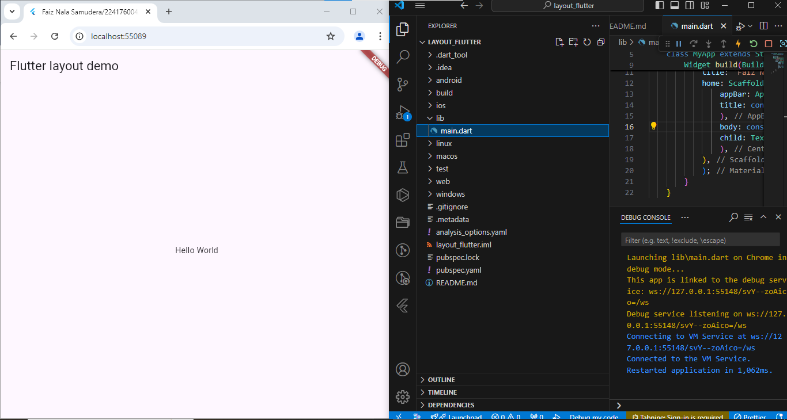

<h1>LAPORAN PRAKTIKUM PEMROGRAMAN BERBASI MOBILE</h1>
Dosen Pembimbing : Ade Ismail, S.Kom, M, TI. <hr>
Nama : Faiz Nala Samudera<br>
Kelas : SIB3D<br>
NIM : 2241760043<br><hr>


<h3>Praktikum 1 : Membangun Layout di Flutter</h3>

1. Buatlah sebuah project flutter baru dengan nama layout_flutter. Atau sesuaikan style laporan praktikum yang Anda buat.
2. Buka file main.dart lalu ganti dengan kode berikut. Isi nama dan NIM Anda di text title.
    ```
    import 'package:flutter/material.dart';

    void main() => runApp(const MyApp());

    class MyApp extends StatelessWidget {
        const MyApp({super.key});

        @override
        Widget build(BuildContext context) {
            return MaterialApp(
            title: 'Faiz Nala Samudera/2241760043',
            home: Scaffold(
                appBar: AppBar(
                title: const Text('Flutter layout demo'),
                ),
                body: const Center(
                child: Text('Hello World'),
                ),
            ),
            );
        }
    }
    ```
    

3. Langkah pertama adalah memecah tata letak menjadi elemen dasarnya:
    - Identifikasi baris dan kolom.
    - Apakah tata letaknya menyertakan kisi-kisi (grid)?
    - Apakah ada elemen yang tumpang tindih?
    - Apakah UI memerlukan tab?
    - Perhatikan area yang memerlukan alignment, padding, atau borders.