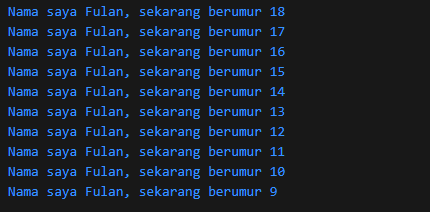

<h1>LAPORAN PEMROGRAMAN BERBASIS MOBILE</h1>
Dosen Pembimbing : Ade Ismail S.Kom, M.Ti
<hr>
Nama : Faiz Nala Samudera <br>
NIM : 2241760043 <br>        
Kelas : SIB 3D <br>
<hr>

1. Modifikasilah kode pada baris 3 di VS Code atau Editor Code favorit Anda berikut ini agar mendapatkan keluaran (output) sesuai yang diminta!<br>
    ```
    void main() {
        for (int i = 18; i >= 9; i--) {
            print('Nama saya Fulan, sekarang berumur $i');
        }
    }
    ```
    hasil<br>
    

2. Mengapa sangat penting untuk memahami bahasa pemrograman Dart sebelum kita menggunakan framework Flutter ? Jelaskan!<br>
    Alasan mengapa sangat penting memahami dart sebelum menggunakan framework flutter adalah dart merupakan kunci untuk menguasai Flutter secara menyeluruh karena Flutter menggunakan bahasa dart untuk sebagai bahasa dasar dalam membangun frameworknya. Sehingga untuk memulai menggunakan framework flutter seorang programmer diharuskan untuk memahami bahasa dart mulai dari sintaksisnya, operasi logika, aritmatika, dll.
3. Rangkumlah materi dari codelab ini menjadi poin-poin penting yang dapat Anda gunakan untuk membantu proses pengembangan aplikasi mobile menggunakan framework Flutter.<br>
    <b>Dart</b> adalah inti dari framework Flutter. Dimana Dart memiliki fitur-fitur bahasa pemrograman terkini seperti : productive tooling, garbage collection, type annotation, statically typed, dan portability. Dart diluncurkan pada tahun 2011, dan dari sejak Dart telah merilis versi stabilnya pada tahun 2013 dengan perubahan besar termasuk dalam rilis Dart 2.0 menjelang akhir 2018.  Seperti kebanyakan bahasa modern, Dart dirancang untuk object-oriented (OO). Sesuai prinsip OO memastikan bahwa Dart memiliki fitur encapsulation, inheritance, composition, abstraction, dan polymorphism.<br>
    <b>Dart Operator : </b> 
    Di Dart, operator tidak lebih dari method yang didefinisikan dalam class dengan sintaks khusus. Jadi, ketika Anda menggunakan operator seperti x == y, seolah-olah Anda sedang memanggil x.==(y) metode untuk melakukan perbandingan kesetaraan.<br>
    <b>Arithmetic operator : </b>
    Sama seperti operator aritmatik lainnya, contoh operator aritmatik pada dart adalah : 
    '+' untuk tambahan, '-' untuk pengurangan, '*' untuk perkalian, '/' untuk pembagian, '~/' untuk pembagian bilangan bulat, dll.
    <b>Increment and decrement operator : </b>
    Operator penambahan dan pengurangan juga merupakan operator umum dan diimplementasikan pada angka, sebagai berikut: 
    + ++var atau var++ untuk menambah nilai variabel var sebesar 1 
    + --var atau var-- untuk mengurangi nilai variabel var sebesar 1

    <b>Equality and relational operators : </b> 
    Persamaan operator Dart dijelaskan sebagai berikut: 
    + '==' untuk memeriksa apakah operan sama 
    + '!=' untuk memeriksa apakah operan berbeda 
    Untuk melakukan pengujian relasional, maka gunakan operator sebagai berikut: <br>
    + '>' memeriksa apakah operan kiri lebih besar dari operan kanan 
    + '<' memeriksa apakah operan kiri lebih kecil dari operan kanan 
    + '>=' memeriksa apakah operan kiri lebih besar dari atau sama dengan operan kanan 
    + '<=' memeriksa apakah operan kiri kurang dari atau sama dengan operan kanan

    <b>Logical operators</b> 
    Operator logika di Dart adalah operator yang diterapkan pada operan bool; bisa berupa variabel, ekspresi, atau kondisi..
    Operator logika yang disediakan adalah sebagai berikut: 
    + !expression negasi atau kebalikan hasil ekspresi—yaitu, true menjadi false dan false menjadi true. 
    + || menerapkan operasi logika OR antara dua ekspresi. 
    + && menerapkan operasi logika AND antara dua ekspresi.<br>
    <b>Main function</b>
    Seperti kebanyakan bahasa modern, Dart menggunakan function dan method sebagai cara untuk memisahkan kode. Sebuah function atau method adalah potongan kode yang menerima beberapa data, eksekusi kode, dan kemudian mengembalikan beberapa data (return).


    
