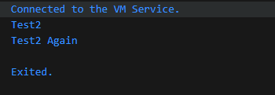
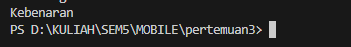
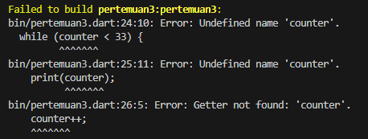
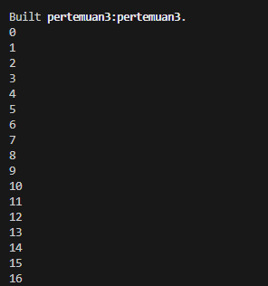
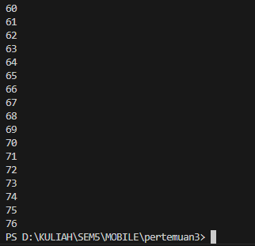
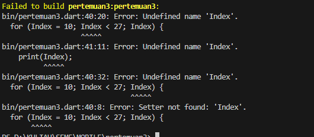
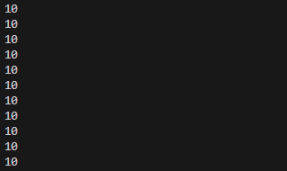
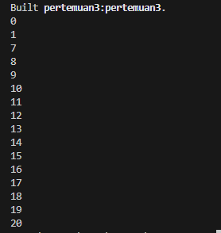
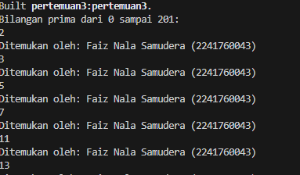

<h1>LAPORAN PEMROGRAMAN BERBASIS MOBILE</h1>
Dosen Pengampu : Ade Ismail S.Kom, M.TI <hr>
Nama : Faiz Nala Samudera <br>
NIM : 2241760043 <br>
Kelas : SIB-3D <hr><br>

<h3>Praktikum 1</h3><hr>

1. Ketik atau salin kode program berikut ke dalam fungsi main(). <br>
    ```
    void main() {
        String test = "test2";
        if (test == "test") {
            print('Test1');
        } else if (test == "test2") {
            print('Test2');
        } else {
            print('Something else');
        }

        if (test == "test2") {
            print("Test2 Again");
        }
    }
    ```

2. Silakan coba eksekusi (Run) kode pada langkah 1 tersebut. Apa yang terjadi? Jelaskan! <br>
     <br>
    Pada saat dijalankan maka aka muncul hasil test2 dan test2 again, hal ini dikarenakan variabel test akan diperiksa melalui logika if else apakah nilai yang tersimpan pada variabel test sama dengan kata yang dipersayaratkan/memenuhi kondisi logika if else. 

3. Tambahkan kode program berikut, lalu coba eksekusi (Run) kode Anda. <br>

    ```
    bool test1 = true;
    if (test1) {
        print("Kebenaran");
    }
    ```
     <br>
    Pada saat dijalankan perlu dilakukan penyesuaian yaitu mengubah nama variabel test karena terdapat duplikasi nama variabel dengan variabel test pada langkah sebelumnya, lalu melakukan pergantian tipe data dari String menjadi bool serta menghapus tanda petik 2 pada kaa true. Sehingga program akan menghasilkan output kata <b>"kebenaran"</b><br><br>

<h3>Praktikum 2</h3><hr>

1. Ketik atau salin kode program berikut ke dalam fungsi main(). <br>
    ```
    void main() {
        while (counter < 33) {
            print(counter);
            counter++;
        }
    }
    ```
2. Silakan coba eksekusi (Run) kode pada langkah 1 tersebut. Apa yang terjadi? Jelaskan! Lalu perbaiki jika terjadi error. <br>

     <br>
    Pada saat dijalankan akan muncul error seperti tampilan diatas karena variabel counter belum diinisialisasi nilainya. sehingga perlu adanya perbaikan sebagai berikut : 
    ```
    void main() {
        int counter = 0;
        while (counter < 33) {
            print(counter);
            counter++;
        }
    }   
    ```
    sehingga program akan menghasilkan output : <br>
     <br>

3. Tambahkan kode program berikut, lalu coba eksekusi (Run) kode Anda. <br>
    ```
    do {
        print(counter);
        counter++;
    } while (counter < 77);
    ```
    Apa yang terjadi ? Jika terjadi error, silakan perbaiki namun tetap menggunakan do-while. <br>
    Pada saat dijalankan akan muncul error seperti sebelumnya karena variabel counter belum diinisialisasi. sehingga perlu adanya perbaikan sebagai berikut : <br>     

    ```
    void main() {
        int counter = 0;
        do {
            print(counter);
            counter++;
        } while (counter < 77);
    }
    ```
    dan akan menghasilkan output sebagai berikut : <br>
     <br>
    Dimana secara umum perbedaan antara while dengan do-while adalah pada proses pengecekan kondisi, dimana while akan mengecek kondisi terlebih dahulu sebelum program dijalankan sedengkan do-while akan menjalankan program satu kali sebelum pengecekan kondisi dilakukan.</br><br>

<h3>Praktikum 3</h3><hr>

1. Ketik atau salin kode program berikut ke dalam fungsi main(). <br>

    ```
    for (Index = 10; index < 27; index) {
        print(Index);
    }
    ```

2. Silakan coba eksekusi (Run) kode pada langkah 1 tersebut. Apa yang terjadi? Jelaskan! Lalu perbaiki jika terjadi error. <br>
     <br>
    Pada saat dijalankan maka akan muncul error seperti gambar diatas karena variabel Index masih belum didekralasikan tipe datanya. Sehingga perlu adanya perbaikan seperti berikut : 
    ```
    void main() {
        for (int Index = 10; Index < 27; Index) {
            print(Index);
        }
    }
    ```
    Maka setelah perbaikan dilakukan akan menghasilkan output sebagai berikut : <br>
     <br>

3. Tambahkan kode program berikut di dalam for-loop, lalu coba eksekusi (Run) kode Anda. <br>
    ```
    If (Index == 21) break;
        Else If (index > 1 || index < 7) continue;
        print(index);
    ```
    Apa yang terjadi ? Jika terjadi error, silakan perbaiki namun tetap menggunakan for dan break-continue. <br>
    Pada saat dijalanka kode yang diberikan akan mengalami error karena variabel Index belum dideklarasikan tipe datanya. dan juga setelah diperbaiki logika else if tidak akan menghasilkan output apa-apa pada saat dijalankan karena logika or tidak dapat menghasilkan output apapun saat kode dijalankan sehingga diperlukan perbaikan kode sebagai berikut : <br>
    ```
    void main() {
        for (int Index = 0; Index < 27; Index++) {
            if (Index == 21) break;
            else if (Index > 1 && Index < 7)continue;
            print(Index);
        }
    }
    ```
    Dan ketika dijalankan kembali akan menghasilkan output sebagi berikut : <br>
    <br><br>

<h3>Tugas Praktikum</h3><hr>

1. Silakan selesaikan Praktikum 1 sampai 3, lalu dokumentasikan berupa screenshot hasil pekerjaan beserta penjelasannya!
2. Buatlah sebuah program yang dapat menampilkan bilangan prima dari angka 0 sampai 201 menggunakan Dart. Ketika bilangan prima ditemukan, maka tampilkan nama lengkap dan NIM Anda.
    ```
    void main() {
        const namaLengkap = "Faiz Nala Samudera";
        const nim = "2241760043";

        print("Bilangan prima dari 0 sampai 201:");

        for (int i = 2; i <= 201; i++) {
            bool isPrime = true;

            for (int j = 2; j * j <= i; j++) {
            if (i % j == 0) {
                isPrime = false;
                break;
            }
            }

            if (isPrime) {
            print("$i");
            print("Ditemukan oleh: $namaLengkap ($nim)");
            }
        }
    }
    ```
    hasil : <br>
    


    
