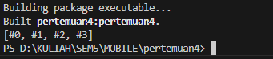

<h1>LAPORAN PRAKTIKUM PEMROGRAMAN BERBASIS MOBILE</h1>
Dosen Pembimbing : Ade Ismail, S.Kom, M.TI <hr>
Nama : Faiz Nala Samudera <br>
NIM : 2241760043 <br>
Absen : 13 <br>
Kelas : SIB 3D <hr><br>


<h3>Praktikum 1</h3><hr>

1. Ketik atau salin kode program berikut ke dalam void main().

    ```
        var list = [1, 2, 3];
        assert(list.length == 3);
        assert(list[1] == 2);
        print(list.length);
        print(list[1]);

        list[1] = 1;
        assert(list[1] == 1);
        print(list[1]); 
    ```
2. Silakan coba eksekusi (Run) kode pada langkah 1 tersebut. Apa yang terjadi? Jelaskan! <br>

    <br>

    Pada Saat dijalankan maka akan muncul outpu seperti gambar diatas. dimana pengunaan method assert berfungsi sebagai method logika yang akan memeriksa kondisi yang telah didefinisikan dalam method tersebut.<br>

3. Ubah kode pada langkah 1 menjadi variabel final yang mempunyai index = 5 dengan default value = null. Isilah nama dan NIM Anda pada elemen index ke-1 dan ke-2. Lalu print dan capture hasilnya. Apa yang terjadi ? Jika terjadi error, silakan perbaiki. <br>

    <br>
    Pada saat dijalankan maka akan muncul pesan error karena variabel dengan tipe string pada array/ list dengan jenis filled tidak bisa di-assign bernilai null. cara untuk mengatasinya adalah dengan menentukan tipe list-nya sebagai List<dynamic> atau List<Object?> <br>
    ```
    void main() {
        final List<dynamic> list = List.filled(5, null); // Membuat list dengan panjang 5, nilai default null
        list[1] = 'Faiz Nala Samudera'; 
        list[2] = '2241760043'; 
        
        print(list.length);
        print(list); 
    }
    ```
    Sehingga setelah perbaikan akan menghhasilkan output sebagai berikut : <br>
    <br><br>

<h3>Praktikum 2</h3><hr>

1. Ketik atau salin kode program berikut ke dalam fungsi main().
    ```
    var halogens = {'fluorine', 'chlorine', 'bromine', 'iodine', 'astatine'};
    print(halogens);
    ```
2. Silakan coba eksekusi (Run) kode pada langkah 1 tersebut. Apa yang terjadi? Jelaskan! Lalu perbaiki jika terjadi error. 
    <br>
    Pada saat dijalankan maka akan memunculkan output seperti gambar diatas.
3. Tambahkan kode program berikut, lalu coba eksekusi (Run) kode Anda.
    ```
    var names1 = <String>{};
    Set<String> names2 = {}; // This works, too.
    var names3 = {}; // Creates a map, not a set.

    print(names1);
    print(names2);
    print(names3);
    ```
    Apa yang terjadi ? Jika terjadi error, silakan perbaiki namun tetap menggunakan ketiga variabel tersebut. Tambahkan elemen nama dan NIM Anda pada kedua variabel Set tersebut dengan dua fungsi berbeda yaitu .add() dan .addAll(). Untuk variabel Map dihapus, nanti kita coba di praktikum selanjutnya. <br><br>
    Pada Saat dijalankan tidak akan memnculkan error namun saat program dijalankan maka akan menghasilkan beberapa set yang kosong karena program hanya mendeklarasikan set yang kosong. Sehingga akan menghasilkan output seperti gambar berikut : <br>
    <br>
    Lalu untuk modifikasinya adalah sebagi berikut :<br>
    <br>
    Dimana : 
    - method add() : menambahkan satu elemen pada set.
    - method addAll() : menambahkan beberapa elemen pada set. <br><br>

<h3>Praktikum 3</h3><hr>

1. Ketik atau salin kode program berikut ke dalam fungsi main().
    ```
    var gifts = {
    // Key:    Value
    'first': 'partridge',
    'second': 'turtledoves',
    'fifth': 1
    };

    var nobleGases = {
    2: 'helium',
    10: 'neon',
    18: 2,
    };

    print(gifts);
    print(nobleGases);
    ```
2. Silakan coba eksekusi (Run) kode pada langkah 1 tersebut. Apa yang terjadi? Jelaskan! Lalu perbaiki jika terjadi error.
    <br>
    Pada saat dijalankan maka akan menghasilkan output seperti gambar diatas, dimana set dapat menyimpan lebih dari 1 elemen dalam saru variabel
3. Tambahkan kode program berikut, lalu coba eksekusi (Run) kode Anda.
    ```
    var mhs1 = Map<String, String>();
    gifts['first'] = 'partridge';
    gifts['second'] = 'turtledoves';
    gifts['fifth'] = 'golden rings';

    var mhs2 = Map<int, String>();
    nobleGases[2] = 'helium';
    nobleGases[10] = 'neon';
    nobleGases[18] = 'argon';
    ```
    Apa yang terjadi ? Jika terjadi error, silakan perbaiki. <br>
     <br>
    Pada saat dijalankan akan muncul error karena variabel gifts dan nobleGases belum didefisikan. sehingga perlu perbaikan sebagai berikut : 
    ```
    void main () {
        var mhs1 = Map<String, String>();
        mhs1['first'] = 'partridge';
        mhs1['second'] = 'turtledoves';
        mhs1['fifth'] = 'golden rings';

        var mhs2 = Map<int, String>();
        mhs2[2] = 'helium';
        mhs2[10] = 'neon';
        mhs2[18] = 'argon';

        print(mhs1);
        print(mhs2);
    }
    ```
    Tambahkan elemen nama dan NIM Anda pada tiap variabel di atas (gifts, nobleGases, mhs1, dan mhs2). Dokumentasikan hasilnya dan buat laporannya!
    ```
    void main () {
        var mhs1 = Map<String, String>();
        mhs1['first'] = 'partridge';
        mhs1['second'] = 'turtledoves';
        mhs1['fifth'] = 'golden rings';
        mhs1['nama'] = 'Faiz Nala Samudera';
        mhs1['nim'] = '2241760043';

        var mhs2 = Map<int, String>();
        mhs2[2] = 'helium';
        mhs2[10] = 'neon';
        mhs2[18] = 'argon';
        mhs2[20] = 'Faiz Nala Samudera';
        mhs2[22] = '2241760043';

        print(mhs1);
        print(mhs2);
    }
    ```
    <br>

<h3>Praktikum 4</h3><hr>

1. Ketik atau salin kode program berikut ke dalam fungsi main().
    ```
    var list = [1, 2, 3];
    var list2 = [0, ...list];
    print(list);
    print(list2);
    print(list2.length);
    ```
2. Silakan coba eksekusi (Run) kode pada langkah 1 tersebut. Apa yang terjadi? Jelaskan! Lalu perbaiki jika terjadi error.
    <br>
    Pada saat dijalankan program akan menghasilkan output seperti gambar diatas, dimana var list2 = [0, ...list]; menggunakan spread operator (...) untuk menambahkan semua elemen dari list ke list2. Artinya, list2 akan berisi [0] ditambah semua elemen dari list ([1, 2, 3]), sehingga hasil akhirnya adalah [0, 1, 2, 3].
3. Tambahkan kode program berikut, lalu coba eksekusi (Run) kode Anda.
    ```
    list1 = [1, 2, null];
    print(list1);
    var list3 = [0, ...?list1];
    print(list3.length);
    ```
    <br>
    Pada saat dijalankan makan program akan menghasilkan output seperti gambar diatas. dimana value dengan nilai null dapat dimasukkan ke dalam list. <br>
    Tambahkan variabel list berisi NIM Anda menggunakan Spread Operators. Dokumentasikan hasilnya dan buat laporannya! <br>
    ```
    void main() {
        var list = [1, 2, 3];
        var listNIM = ['2241760043']; 
        var list2 = [0, ...list, ...listNIM];
        
        print(list); 
        print(list2); 
        print(list2.length); 
    }
    ```
    
4. Tambahkan kode program berikut, lalu coba eksekusi (Run) kode Anda.
    ```
    var nav = ['Home', 'Furniture', 'Plants', if (promoActive) 'Outlet'];
    print(nav);
    ```
    Apa yang terjadi ? Jika terjadi error, silakan perbaiki. Tunjukkan hasilnya jika variabel promoActive ketika true dan false.<br>
    Pada saat dijalankan maka akan muncul error karena variabel promoActive tidak didefinisikan sehingga program akan mengalami error saat dijalankan. Sehingga perlu adanya perbaikan dengan menambahkan variabel dengan nama promoActive yang bertipe data bool. 
    ```
    void main() {
        var promoActive = true;
        var nav = ['Home', 'Furniture', 'Plants', if (promoActive) 'Outlet'];
        print(nav);
    }
    ```
    <br>
    Pada saat dijalankan, program kondisi true akan menambahkan data outlet pada variabel nav, sedangkan jika kondisi false maka data outlet tidak akan ditambahkan.
5. Tambahkan kode program berikut, lalu coba eksekusi (Run) kode Anda.
    ```
    var nav2 = ['Home', 'Furniture', 'Plants', if (login case 'Manager') 'Inventory'];
    print(nav2);
    ```
    Pada saat dijalankan maka akan muncul error karena karena variabel login tidak didefinisikan. Sehingga perlu adanya perbaikan sebagai berikut : 
    ```
    void main() {
        var login = 'Manager';
        var nav2 = ['Home', 'Furniture', 'Plants', if (login case 'Manager') 'Inventory'];
        print(nav2);
    }
    ```
    

6. Tambahkan kode program berikut, lalu coba eksekusi (Run) kode Anda.
    ```
    var listOfInts = [1, 2, 3];
    var listOfStrings = ['#0', for (var i in listOfInts) '#$i'];
    assert(listOfStrings[1] == '#1');
    print(listOfStrings);
    ```
    Apa yang terjadi ? Jika terjadi error, silakan perbaiki. Jelaskan manfaat Collection For dan dokumentasikan hasilnya.<br>
    <br>
    Collection For di Dart memungkinkan pembuatan koleksi dengan cara yang efisien dan terstruktur, mengurangi kompleksitas dan meningkatkan keterbacaan kode.

<h3>Praktikum 5</h3><hr>

1. Ketik atau salin kode program berikut ke dalam fungsi main().
    ```
    var record = ('first', a: 2, b: true, 'last');
    print(record)
    ```
2. Silakan coba eksekusi (Run) kode pada langkah 1 tersebut. Apa yang terjadi? Jelaskan! Lalu perbaiki jika terjadi error.
    <br>
    Pada saat dijalankan program akan menghasilkan output seperti gambar diatas
3. Tambahkan kode program berikut di luar scope void main(), lalu coba eksekusi (Run) kode Anda.
    ```
    (int, int) tukar((int, int) record) {
        var (a, b) = record;
        return (b, a);
    }
    ```
    Apa yang terjadi ? Jika terjadi error, silakan perbaiki. Gunakan fungsi tukar() di dalam main() sehingga tampak jelas proses pertukaran value field di dalam Records.<br>
    <br>
    Pada saat dijalankan maka akan menghasilkan output seperti gambar diatas. dimana tidak terjadi error namun tidak terjadi perubahan apapun pada outputnya dikarenakan swap akan terjadi pada variabel dengan tipedata int. sehingga perlunya perbaikan sebagai berikut <br>
    ```
    (int, int) tukar((int, int) record) {
    var (a, b) = record;
    return (b, a);
    }

    void main() {
        var record = (1, 2); // Record yang sesuai dengan (int, int)
        print('Original record: $record');

        var swapped = tukar(record);
        print('Swapped record: $swapped');
    }
    ```
     <br>
4. Tambahkan kode program berikut di dalam scope void main(), lalu coba eksekusi (Run) kode Anda.
    ```
    // Record type annotation in a variable declaration:
    (String, int) mahasiswa;
    print(mahasiswa);
    ```
    Apa yang terjadi ? Jika terjadi error, silakan perbaiki. Inisialisasi field nama dan NIM Anda pada variabel record mahasiswa di atas. Dokumentasikan hasilnya dan buat laporannya! <br>
    Pada saat dijalankan maka akan mucul error karena variabel mahasiswa belum dideklarasikan dan belum diinisialisasikan. sehingga perlunya perbaikan sebagai berikut : 
    ```
    void main() {
        // Inisialisasi record dengan tipe (String, int)
        (String, int) mahasiswa = ('Faiz Nala Samudera', 2241760043);
        print(mahasiswa);

        (String, int) mahasiswa2; 
        mahasiswa2 = ('Salam Salami', 2241760044); 
        print(mahasiswa2);
    }
    ```
     <br>
5. Tambahkan kode program berikut di dalam scope void main(), lalu coba eksekusi (Run) kode Anda.
    ```
        var mahasiswa2 = ('first', a: 2, b: true, 'last');

        print(mahasiswa2.$1); // Prints 'first'
        print(mahasiswa2.a); // Prints 2
        print(mahasiswa2.b); // Prints true
        print(mahasiswa2.$2); // Prints 'last'
    ```
    Apa yang terjadi ? Jika terjadi error, silakan perbaiki. Gantilah salah satu isi record dengan nama dan NIM Anda, lalu dokumentasikan hasilnya dan buat laporannya! <br>
     <br>
    Pada saat dijalankan program akan menghasilkan output sepeti gambar diatas. Record dalam Dart dapat diakses baik menggunakan posisi $n untuk elemen yang tidak dinamai, maupun nama untuk elemen yang dinamai dan elemen record dengan posisi dan nama dapat diakses sesuai dengan deklarasinya.<br>

<h3>Tugas Praktikum</h3><hr>

1. Silakan selesaikan Praktikum 1 sampai 5, lalu dokumentasikan berupa screenshot hasil pekerjaan Anda beserta penjelasannya!
2. Jelaskan yang dimaksud Functions dalam bahasa Dart!
    Functions di Dart adalah blok kode yang dapat dieksekusi ketika dipanggil. Mereka dapat menerima argumen (input) dan mengembalikan nilai (output). Dart mendukung berbagai jenis fungsi seperti fungsi biasa, fungsi anonim, fungsi dengan parameter opsional, dan lainnya. Functions memudahkan pengorganisasian kode dan meningkatkan keterbacaan serta kemampuan untuk digunakan kembali.
3. Jelaskan jenis-jenis parameter di Functions beserta contoh sintaksnya!
    - Positional Parameters: Parameter standar yang diharuskan ketika fungsi dipanggil.
    - Optional Positional Parameters: Parameter yang bersifat opsional, ditulis dalam tanda kurung siku [].
    - Named Parameters: Parameter yang diberi nama dan bersifat opsional, ditulis dalam kurung kurawal {}.
    - Default Parameters: Parameter yang memiliki nilai default jika tidak diberikan saat fungsi dipanggil.
    - contoh : 
        ```
        // Positional Parameters
        void sayHello(String name) {
            print('Hello $name');
        }

        // Optional Positional Parameters
        void greet(String name, [String? message]) {
            print('Hello $name, $message');
        }

        // Named Parameters
        void introduce({required String name, int age = 18}) {
            print('My name is $name and I am $age years old');
        }

        // Default Parameters
        void sayGoodbye(String name, {String message = 'Goodbye'}) {
            print('$message $name');
        }
        ```
4. Jelaskan maksud Functions sebagai first-class objects beserta contoh sintaknya!
    Dart memperlakukan functions sebagai first-class objects, artinya fungsi dapat: Disimpan dalam variabel, dilewatkan sebagai paraeter ke fungsi lain, dikembalikan sebagai nilai dari fungsi lain.
    ```
    // Menyimpan function dalam variabel
        var add = (int a, int b) => a + b;

    void executeOperation(Function operation, int x, int y) {
        print(operation(x, y));
    }

    void main() {
        executeOperation(add, 5, 3); // Output: 8
    }
    ```
5. Apa itu Anonymous Functions? Jelaskan dan berikan contohnya!
    Anonymous Functions (fungsi tanpa nama) adalah fungsi yang tidak didefinisikan dengan nama dan biasanya digunakan saat fungsi hanya dipakai sekali atau sebagai parameter ke fungsi lain. Anonymous function juga bisa menggunakan arrow syntax (=>) untuk mengembalikan satu ekspresi.
    ```
    // Anonymous function
    var multiply = (int a, int b) {
        return a * b;
    };

    // Menggunakan dalam list atau fungsi higher-order
    var list = [1, 2, 3];
    list.forEach((item) {
        print(item * 2);  // Output: 2, 4, 6
    });
    ```
6. Jelaskan perbedaan Lexical scope dan Lexical closures! Berikan contohnya!
    - Lexical Scope: Merujuk pada aturan dimana variabel dapat diakses dalam fungsi berdasarkan tempat fungsi tersebut dideklarasikan. Variabel yang dideklarasikan di luar fungsi dapat diakses di dalam fungsi, tetapi variabel di dalam fungsi tidak bisa diakses dari luar.
        ```
        int globalVar = 10;

        void printVar() {
            print(globalVar);  // Output: 10, dapat mengakses       variabel global
        }

        void main() {
            printVar();
        }
        ```
    - Lexical Closures: Merupakan konsep di mana fungsi dalam Dart dapat "menangkap" variabel dari scope luar (enclosing scope) walaupun scope tersebut sudah tidak aktif. Closures dapat menyimpan dan mengakses variabel luar walaupun eksekusi fungsi utama telah selesai.
        ```
        Function counter() {
            int count = 0;
            return () {
                count++;
                return count;
            };
        }

        void main() {
            var myCounter = counter();
            print(myCounter()); // Output: 1
            print(myCounter()); // Output: 2
        }
        ```
7. Jelaskan dengan contoh cara membuat return multiple value di Functions!
    Dart tidak memiliki dukungan langsung untuk mengembalikan beberapa nilai, tetapi kita bisa menggunakan beberapa pendekatan seperti menggunakan List, Map, atau membuat kelas khusus untuk mengembalikan beberapa nilai.
    ```
    // Contoh dengan list
    List<int> getDimensions() {
        int width = 10;
        int height = 20;
        return [width, height];
    }

    void main() {
        var dimensions = getDimensions();
        print('Width: ${dimensions[0]}, Height: ${dimensions[1]}');
    }
    ```
    ```
    // Contoh dengan map
    Map<String, int> getDimensions() {
        return {'width': 10, 'height': 20};
    }

    void main() {
        var dimensions = getDimensions();
        print('Width: ${dimensions['width']}, Height: ${dimensions['height']}');
    }

    ```
    Dengan cara ini, kita bisa mengembalikan lebih dari satu nilai dari sebuah fungsi.
8. Kumpulkan berupa link commit repo GitHub pada tautan yang telah disediakan di grup Telegram!